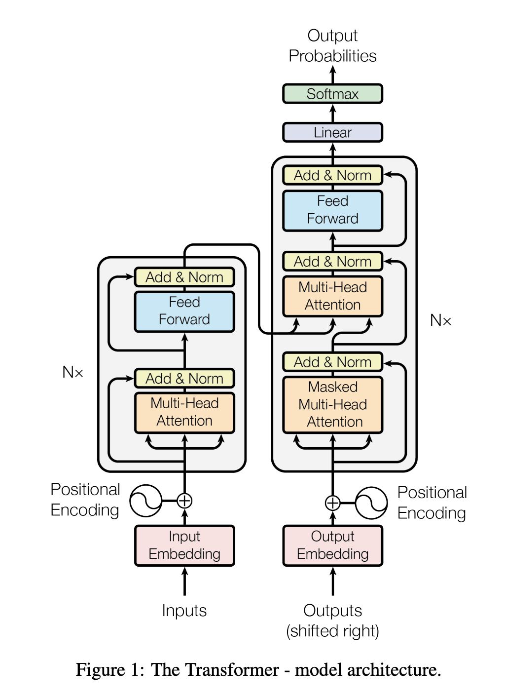

# Large Language Models

Los large language models o LLMs son estructuras de redes neuronales pensadas especialmente para la generación del lenguaje.

Heredan mucha de la tarea anteriormente realizada que ha terminado siendo condensada en lo que conocemos como Transformers.

Entender la estructura de estos modelos es clave para poder saber de sus posibilidades y limitaciones. Una pieza clave del proceso es el mecanismo de atención y los bloques _transformers_ compuestos de tres piezas que podemos entender en el contexto de los buscadores (para ejemplificarlo) a pesar de que no son más que tres representaciones vectoriales con sus pesos a aprender asociados:

* La consulta (Q o query) que es el texto de búsqueda que se escribe en la barra de búsqueda. Este es el token sobre el que desea "encontrar más información".
* La clave (K o key) es el título de cada página web en la ventana de resultados de búsqueda. Representa los posibles tokens a los que puede prestar atención la consulta.
* El valor (V) es el contenido real de las páginas web mostradas. Una vez que hemos hecho coincidir el término de búsqueda apropiado (Consulta) con los resultados relevantes (Clave), queremos obtener el contenido (Valor) de las páginas más relevantes.

El concepto de multi-headed se debe a que el mecanismo de atención que presentan estas tres claves puede ser procesado de forma parcial por multiples unidades para captar distintas relacionalidades o puntos de _atención_ sobre el texto.

La arquitectura base de los transformers puede verse en su artículo original _Attention is all you need_ [aquí](https://proceedings.neurips.cc/paper/2017/file/3f5ee243547dee91fbd053c1c4a845aa-Paper.pdf)

* Explicación detallada: https://poloclub.github.io/transformer-explainer/
* Visualizador: https://bbycroft.net/llm

Deberemos entender bien lo que significa la **temperatura** y el **contexto** en estos modelos. El contexto es el máximo número de tokens que puede procesar de una sola vez. Esto es importante porque las LLMs no tienen memoria, con lo cual el límite del contexto determina cuanta información de nuestra conversación les será servida:

* GPT-3: 2048 tokens
* Mistral 7B: 8192 tokens
* GPT-4o: De 60K a 128K tokens
* Claude 3.5: Hasta 100K tokens
* LLama 3.1: Hasta 128K tokens
* Gemini 1.5 Pro: Hasta 1M tokens

Podemos ver y jugar con estos parámetros usando los servicios de playground:

- OpenAI Playground: https://platform.openai.com/playground/prompts
- Google AI Studio: https://aistudio.google.com/prompts/new_chat
- Anthopic Console: https://console.anthropic.com/dashboard

## ¿Qué es ChatGPT?

Digamos que se trata de un sabor de LLM. Quizás uno de los más populares.

Chat GPT es un modelo de lenguaje desarrollado por [OpenIA](https://openai.com/). [OpenAI](https://openai.com/) es una organización de investigación en inteligencia artificial con sede en San Francisco, California. Fue fundada en 2015 por un grupo de investigadores en IA y empresarios, entre ellos Elon Musk, Sam Altman y Greg Brockman.

El objetivo de OpenAI es desarrollar tecnologías de IA de alta calidad y de libre acceso para la sociedad en general. Para lograrlo, la organización lleva a cabo investigaciones en una amplia variedad de áreas, como el aprendizaje profundo, el procesamiento del lenguaje natural y el juego automático.

Algunos de los productos más conocidos son: 
- [DALL-E2](https://openai.com/product/dall-e-2) -> es una herramienta de generación de imágenes por medio de inteligencia artificial. A través de lenguaje natural, es posible indicarle qué queremos que nos dibuje, y la IA creará una imagen única basada en la descripción que le hayamos dado.
- [Whisper](https://platform.openai.com/playground) -> Es un sistema de reconocimiento automático de voz. 
- [ChatGPT](https://chat.openai.com/chat) -> Se trata de un modelo de lenguaje que ha sido entrenado con una gran cantidad de datos de texto para poder realizar una amplia variedad de tareas relacionadas con el lenguaje natural. Su capacidad para comprender el contexto y la intención detrás de las preguntas o consultas de los usuarios lo convierten en una herramienta muy útil para desarrollar chatbots y mejorar la precisión en los sistemas de búsqueda de información.

### ChatGPT - Historia de versiones

- GPT (2018)
- GPT-2 (2019)
- GPT-3 (2020) -> llegada de chatGPT
- GPT-3.5 (2022) 
- [GPT-4](https://openai.com/product/gpt-4) (2023)
- [GPT-4o](https://en.wikipedia.org/wiki/GPT-4o) (2024)
- [o3](https://en.wikipedia.org/wiki/OpenAI_o3) (2025)

### Entrenamientos ChatGPT:

- Cuando entrenaron GPT usaron 117 millones de parámetros. 
- Cuando entrenaron GPT-2 usaron 1.5 miles de millones de parámetros. 
- Cuando entrenaron ChatGPT (GPT-3) usaron 175 miles de millones de parámetros. 
- Cuando entrenaron (GPT-4) han usado más de 100 Billones de parámetros. 

### Herramientas

Para poder comparar le rendimiento de distintos modelos, podemos emplear los recursos de consola que muchos proveedores ofrecen.

Cada vez es más común el uso de soluciones propias donde deberemos emplear herramientas terceras para poder evaluar las respuestas de los sistemas: https://pair-code.github.io/llm-comparator 

Es importante poder entender qué a aprendido y porqué a determinado una salida u otra de cara a justificar los resultados ante posibles autoridades competentes o simplemente tener más certidumbre sobre los resultados: https://pair.withgoogle.com/explorables/fill-in-the-blank/

La iniciativa PAIR de google tiene multiples recursos de mucha utilidad: https://pair.withgoogle.com/explorables/

### Tendencias

Es bueno conocer cómo progresan estas técnicas en base a los distintos proveedores que las implementan: https://metr.org/

Por ejemplo, el tiempo que les toma realizar distintas tareas (con distinto nivel de complejidad)

También hemos visto la evolución de estas soluciones a interacciones más complejas como son los modelos de razonamiento: https://www.datacamp.com/es/tutorial/chain-of-thought-prompting

Estos modelos precisan de una técnica que aún no hemos visto, pero seguro habéis oído hablar de ella. El **aprendizaje por reforzamiento**.

